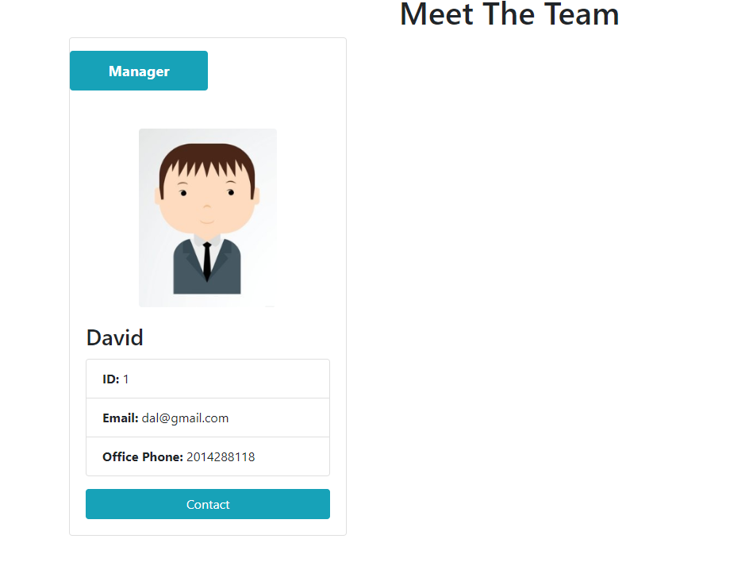
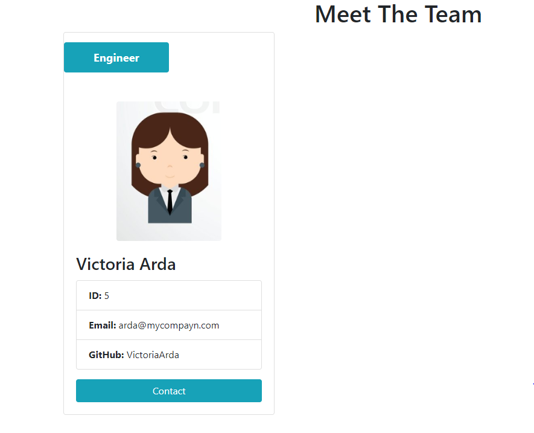
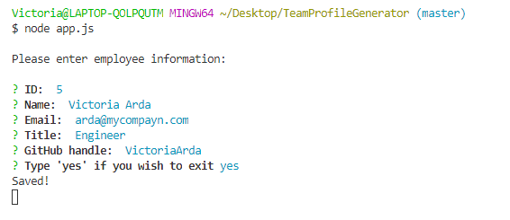

## About

Employee Summary application prompts the user for information about the team manager and then information about the team members. As a user, you can input any number of team members, and they may be a mix of engineers and interns. Once all the team members are logged, the application will create an HTML file that displays a nicely formatted team roster based on the information provided by the user.

## Business Context

```
As a manager
I want to generate a webpage that displays my team's basic info
so that I have quick access to emails and GitHub profiles
```






In the `Develop` folder, there is a `package.json`, so make sure to `npm install`.



The dependencies are, [jest](https://jestjs.io/) for running the provided tests, and [inquirer](https://www.npmjs.com/package/inquirer) for collecting input from the user.
